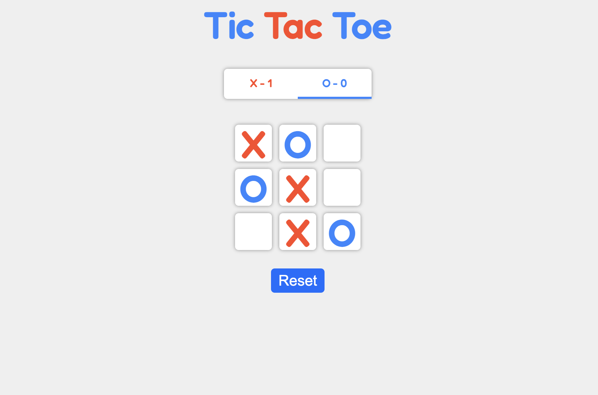

# Tic Tac Toe Game
### 👉 [Go to Tic-Tac-Toe Game](https://tictac25.netlify.app/)

- Welcome to my Tic Tac Toe game built using ReactJS! This classic game allows two players to take turns marking empty cells on a 3x3 grid with their respective symbols, usually X and O. The player who succeeds in placing three of their marks in a horizontal, vertical, or diagonal row wins the game.

# Features

- Interactive gameplay for two players.
- Reset button to start a new game.


# Installation

- To run the Tic Tac Toe game locally on your machine, follow these steps:

1. Clone the repository:

```
   git clone https://github.com/amruta2425/tic-tac-toe-react.git
   cd tic-tac-toe-react

```

2. Install the dependencies:
```
   npm install

 ```


# Usage
### To start the game, run the following command:
```
- npm start
```




